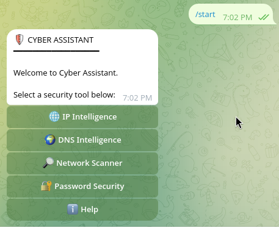
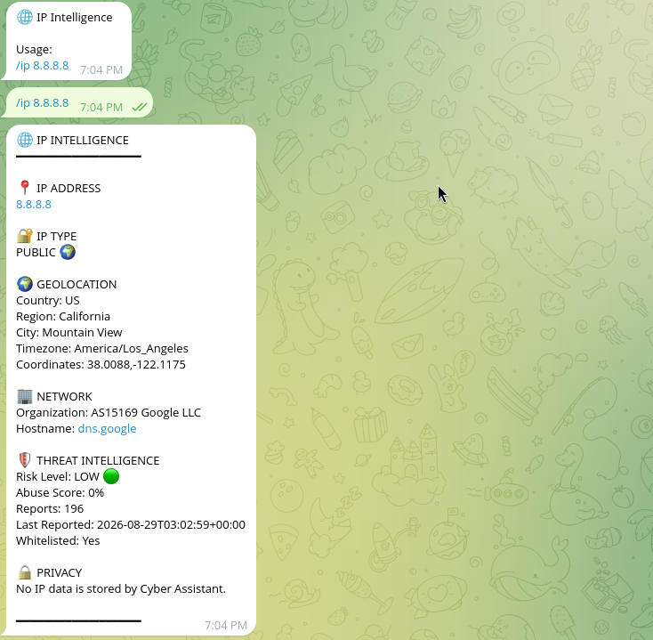
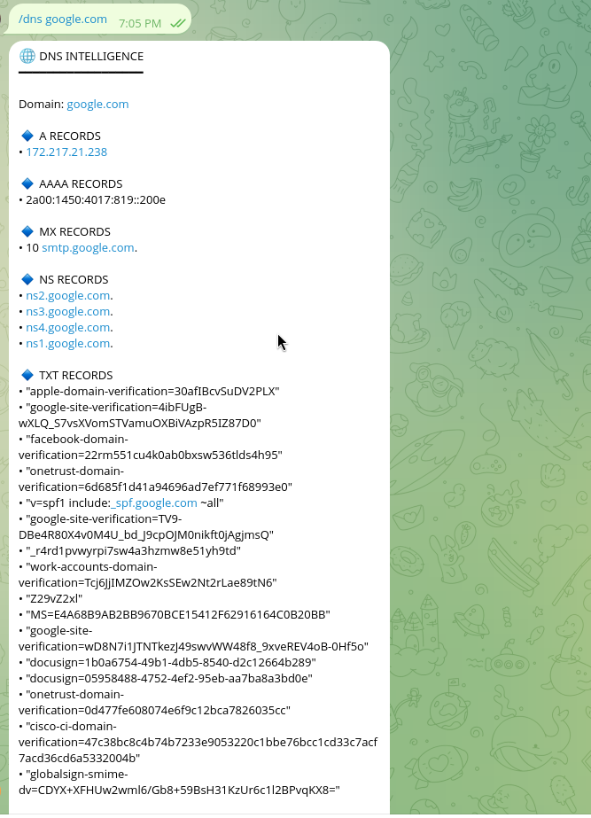
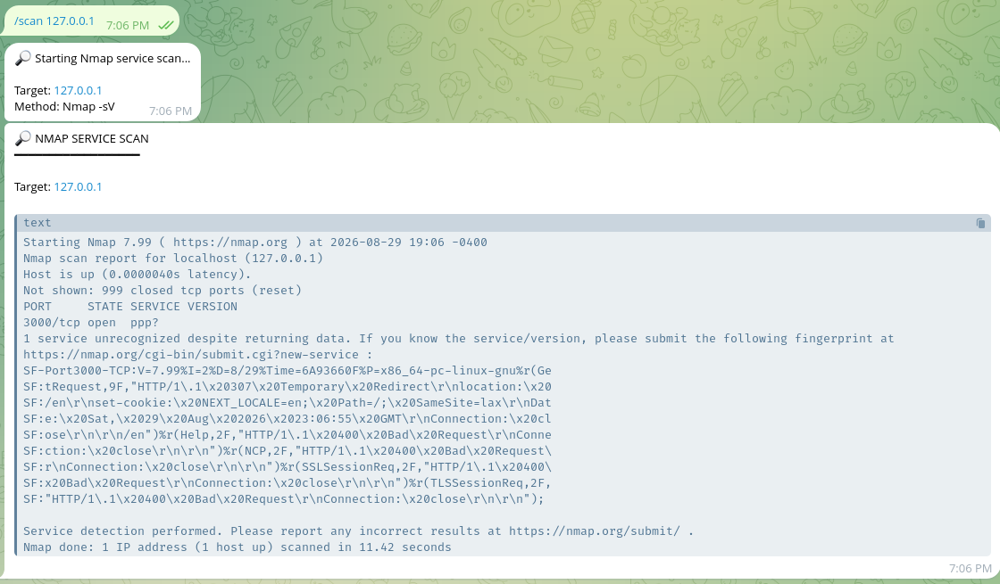

# 🛡️ Cyber Assistant

<div data-importer="image" align="center">
  
</div>

<p align="center">
  <strong>A practical cybersecurity toolkit — directly inside Telegram.</strong>
</p>

<p align="center">
  <a href="https://t.me/cyberassistant_hs_bot">
    
  </a>
  <a href="https://github.com/EmilHuseynovv/cyber-assistant">
    
  </a>
  
</p>

---

## ⚡ About

**Cyber Assistant** is a Python-based Telegram bot that combines practical cybersecurity and network-analysis utilities into one interface.

It is designed for cybersecurity learning, network diagnostics, and **authorized security testing**.

---

## 🚀 Features

| Tool                      | Purpose                                                 |
| ------------------------- | ------------------------------------------------------- |
| 🌐 **IP Intelligence**    | Retrieve available information about an IP address      |
| 🔎 **DNS Lookup**         | Query DNS information for domains and hostnames         |
| 📡 **Nmap Scanner**       | Scan authorized targets and identify ports and services |
| 🛡️ **AbuseIPDB**         | Check IP reputation and abuse reports                   |
| 🔐 **Password Utilities** | Security-focused password utilities                     |

---

## 🤖 Try the Bot

### [🚀 Open Cyber Assistant on Telegram](https://t.me/cyberassistant_hs_bot)

**Bot:** [@cyberassistant_hs_bot](https://t.me/cyberassistant_hs_bot)

---

## 📸 Screenshots

### 🏠 Main Menu



### 🌐 IP Intelligence



### 🔎 DNS Lookup



### 📡 Nmap Scan



---

## 🧰 Tech Stack

[](https://www.python.org/)
[](https://core.telegram.org/bots/api)
[](https://nmap.org/)
[](https://www.linux.org/)
[](https://git-scm.com/)

**Core:** Python · python-telegram-bot · Requests · python-dotenv
**Security:** Nmap · AbuseIPDB
**Environment:** Linux / Kali Linux

---

## 📂 Project Structure

```text
cyber-assistant/
├── assets/
│   ├── start.png
│   ├── ip-intelligence.png
│   ├── dns-lookup.png
│   └── nmap-scan.png
│
├── handlers/
│   ├── __init__.py
│   ├── start.py
│   ├── ip.py
│   ├── dns.py
│   ├── scan.py
│   └── password.py
│
├── services/
│   ├── __init__.py
│   ├── ip_service.py
│   ├── dns_service.py
│   ├── scan_service.py
│   └── password_service.py
│
├── utils/
│   ├── __init__.py
│   ├── formatters.py
│   └── validators.py
│
├── bot.py
├── config.py
├── requirements.txt
├── .env.example
├── .gitignore
├── LICENSE
└── README.md
```

---

## ⚙️ Installation

### Clone the repository

```bash
git clone https://github.com/EmilHuseynovv/cyber-assistant.git
cd cyber-assistant
```

### Create a virtual environment

```bash
python3 -m venv venv
source venv/bin/activate
```

### Install dependencies

```bash
pip install -r requirements.txt
```

### Configure environment variables

Create a `.env` file:

```bash
cp .env.example .env
```

Add your credentials:

```env
BOT_TOKEN=your_telegram_bot_token
ABUSEIPDB_API_KEY=your_abuseipdb_api_key
```

### Run the bot

```bash
python3 bot.py
```

---

## 🔐 Security & Responsible Use

Cyber Assistant is intended for:

* ✅ Cybersecurity education
* ✅ Network diagnostics
* ✅ Authorized security testing
* ✅ Lab environments

Do **not** scan, enumerate, or analyze systems without explicit permission.

Never commit:

```text
.env
BOT_TOKEN
ABUSEIPDB_API_KEY
```

---

## 🗺️ Roadmap

* [ ] WHOIS lookup
* [ ] Subdomain enumeration
* [ ] URL analysis
* [ ] Improved Nmap reports
* [ ] Expanded IP intelligence
* [ ] Additional OSINT utilities
* [ ] Better logging and error handling
* [ ] Automated tests
* [ ] GitHub Actions / CI
* [ ] User preferences

---

## 🤝 Contributing

Suggestions, bug reports, and contributions are welcome.

For major changes, please open an issue first to discuss the proposed change.

---

## 📄 License

Released under the **MIT License**.

---

## 👨‍💻 Author

**Emil Huseynov**

[](https://github.com/EmilHuseynovv)

---

<p align="center">
  <strong>Built with 🐍 Python • 🤖 Telegram • 🛡️ Cybersecurity</strong>
</p>
